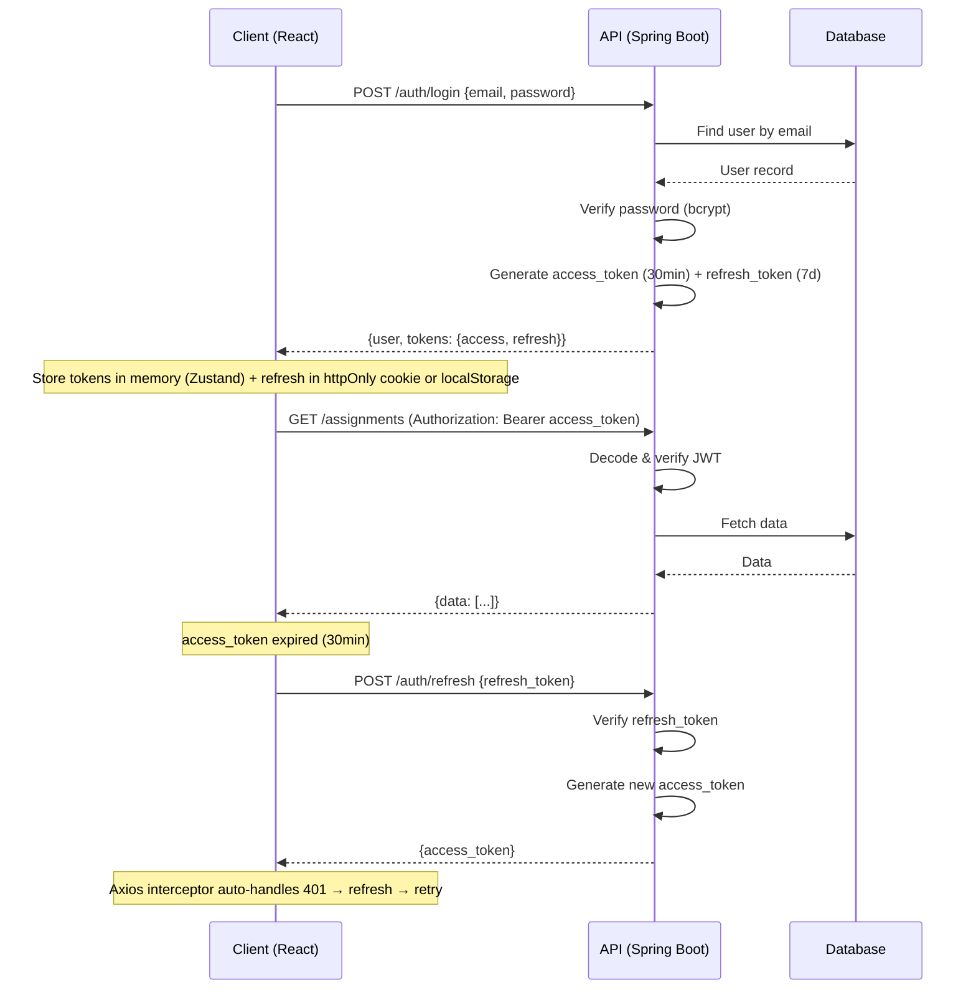

# IICMR EduPortal ERP — Product Requirements Document (PRD)

> **Version:** 1.0  
> **Status:** Final  
> **Created:** 2026-04-14  
> **Project:** IICMR EduPortal — College ERP System  
> **Author:** Development Team  

---

## Table of Contents

1. [Project Overview](#1-project-overview)
2. [Tech Stack Specification](#2-tech-stack-specification)
3. [Project Structure](#3-project-structure)
4. [Database Schema](#4-database-schema)
5. [API Specification](#5-api-specification)
6. [Authentication System](#6-authentication-system)
7. [File Upload Infrastructure](#7-file-upload-infrastructure)
8. [Page & Screen Specifications](#8-page--screen-specifications)
9. [Component Library](#9-component-library)
10. [Animation & Transition Specs](#10-animation--transition-specs)
11. [Notification System](#11-notification-system)
12. [Role-Based Access Control Matrix](#12-role-based-access-control-matrix)
13. [Implementation Plan](#13-implementation-plan)
14. [Non-Functional Requirements](#14-non-functional-requirements)
15. [Risk Assessment](#15-risk-assessment)

---

## 1. Project Overview

### 1.1 Vision
Build a **production-grade college ERP web application** for IICMR that manages the academic lifecycle — from student enrollment and assignment management to grading, attendance tracking, and institutional analytics. The system must be visually impressive, technically scalable, and practically useful.

### 1.2 Problem Statement
The current EduPortal is a collection of static HTML pages using browser-local storage (localStorage/IndexedDB). Data is trapped in individual browsers, making multi-user workflows impossible. There is no proper backend, no real database schema beyond a single `profiles` table, and no file storage infrastructure.

### 1.3 Goals
| Goal | Success Metric |
|---|---|
| Multi-user data persistence | Faculty uploads → Student sees on any device |
| Complete assignment lifecycle | Create → Submit → Grade → Feedback → Analytics |
| Real-time academic tracking | Attendance %, Internal marks, GPA — all live data |
| Professional UI/UX | Dark mode, animations, skeleton loading, responsive |
| Scalable architecture | Clean separation: API ↔ Frontend, modular code, Docker |
| Security | JWT auth, role protection, input validation, file sanitization |

### 1.4 Stakeholders
| Role | Persona | Primary Actions |
|---|---|---|
| **Student** | MCA/MBA/BCA/BBA student | View assignments, submit work, check grades/attendance, download materials |
| **Faculty** | Professor/Instructor | Create assignments, grade work, mark attendance, upload materials, post notices |
| **Admin** | College administrator | Manage users, courses, subjects, view analytics, handle complaints, publish results |

### 1.5 Out of Scope (Not Building)
- Mobile native app (web is responsive, not native)
- QR-based anything (this is a web portal, not an in-classroom app)
- Payment gateway integration (fees are tracked, not collected online)
- Video conferencing / live classes
- Chat / real-time messaging
- Parent portal

---

## 2. Tech Stack Specification

### 2.1 Frontend

| Technology | Version | Purpose |
|---|---|---|
| **React** | 18.x | UI framework |
| **Vite** | 5.x | Build tool & dev server |
| **React Router** | 6.x | Client-side routing + protected routes |
| **Tailwind CSS** | 3.x | Utility-first CSS framework |
| **shadcn/ui** | latest | Accessible component primitives (built on Radix UI) |
| **Framer Motion** | 11.x | Page transitions, micro-interactions |
| **Recharts** | 2.x | Data visualization / charts |
| **TanStack Query** | 5.x | Server state management, caching, background refetch |
| **TanStack Table** | 8.x | Data tables with sort, filter, pagination |
| **Zustand** | 4.x | Lightweight global state (auth, theme) |
| **React Hook Form** | 7.x | Form management |
| **Zod** | 3.x | Schema validation (forms + API responses) |
| **Axios** | 1.x | HTTP client with interceptors |
| **Lucide React** | latest | Icon library |
| **date-fns** | 3.x | Date formatting & manipulation |
| **Sonner** | latest | Toast notifications |
| **cmdk** | latest | Command palette (Ctrl+K search) |

### 2.2 Backend

| Technology | Version | Purpose |
|---|---|---|
| **Java** | 17 LTS | Runtime (LTS for stability) |
| **Spring Boot** | 3.2+ | Web framework (auto-config, embedded Tomcat) |
| **Spring Web (MVC)** | 6.x | REST controllers, request mapping |
| **Spring Security** | 6.x | Authentication, authorization, filter chains |
| **Spring Data JPA** | 3.2+ | ORM repository abstraction over Hibernate |
| **Hibernate** | 6.x | JPA implementation (ORM, entity mapping) |
| **Flyway** | 10.x | Version-controlled database migrations |
| **PostgreSQL JDBC** | 42.x | PostgreSQL driver |
| **jjwt (io.jsonwebtoken)** | 0.12+ | JWT creation, parsing, validation |
| **BCryptPasswordEncoder** | (Spring Security) | Password hashing (built into Spring Security) |
| **Lombok** | 1.18+ | Boilerplate reduction (@Data, @Builder, @Getter) |
| **MapStruct** | 1.5+ | Type-safe DTO ↔ Entity mapping |
| **Jakarta Validation** | 3.x | Request body validation (@Valid, @NotBlank, @Email) |
| **SpringDoc OpenAPI** | 2.3+ | Auto-generated Swagger/OpenAPI docs |
| **Thumbnailator** | 0.4+ | Image resizing (avatar processing) |
| **Maven** | 3.9+ | Build tool & dependency management |

### 2.3 Infrastructure

| Technology | Purpose |
|---|---|
| **PostgreSQL 16** | Primary database |
| **Docker** + **Docker Compose** | Container orchestration |
| **Nginx** (optional) | Reverse proxy for production |

### 2.4 Design System

| Token | Value |
|---|---|
| **Font Family** | `"Inter", system-ui, -apple-system, sans-serif` |
| **Font Mono** | `"JetBrains Mono", monospace` |
| **Border Radius** | `0.5rem` (default), `0.75rem` (cards), `9999px` (pills) |
| **Shadow sm** | `0 1px 2px 0 rgb(0 0 0 / 0.05)` |
| **Shadow md** | `0 4px 6px -1px rgb(0 0 0 / 0.1)` |
| **Shadow lg** | `0 10px 15px -3px rgb(0 0 0 / 0.1)` |
| **Transition default** | `150ms cubic-bezier(0.4, 0, 0.2, 1)` |
| **Transition spring** | `300ms cubic-bezier(0.34, 1.56, 0.64, 1)` |

#### Color Palette (Light Mode)
```
--background:    hsl(0, 0%, 100%)
--foreground:    hsl(222, 47%, 11%)
--card:          hsl(0, 0%, 100%)
--card-fg:       hsl(222, 47%, 11%)
--popover:       hsl(0, 0%, 100%)
--primary:       hsl(221, 83%, 53%)      /* #2563EB - Royal Blue */
--primary-fg:    hsl(0, 0%, 100%)
--secondary:      hsl(210, 40%, 96%)
--secondary-fg:  hsl(222, 47%, 11%)
--muted:         hsl(210, 40%, 96%)
--muted-fg:      hsl(215, 16%, 47%)
--accent:        hsl(210, 40%, 96%)
--accent-fg:     hsl(222, 47%, 11%)
--destructive:   hsl(0, 84%, 60%)        /* #EF4444 - Red */
--success:       hsl(160, 84%, 39%)      /* #10B981 - Emerald */
--warning:       hsl(38, 92%, 50%)       /* #F59E0B - Amber */
--border:        hsl(214, 32%, 91%)
--input:         hsl(214, 32%, 91%)
--ring:          hsl(221, 83%, 53%)
--sidebar:       hsl(222, 47%, 11%)
--sidebar-fg:    hsl(210, 40%, 98%)
```

#### Color Palette (Dark Mode)
```
--background:    hsl(222, 47%, 6%)
--foreground:    hsl(210, 40%, 98%)
--card:          hsl(222, 47%, 9%)
--primary:       hsl(217, 91%, 60%)      /* #3B82F6 */
--secondary:     hsl(217, 33%, 17%)
--muted:         hsl(217, 33%, 17%)
--muted-fg:      hsl(215, 20%, 65%)
--border:        hsl(217, 33%, 17%)
--sidebar:       hsl(222, 47%, 4%)
```

---

## 3. Project Structure

### 3.1 Root Structure
```
eduportal/
├── backend/
├── frontend/
├── docker-compose.yml
├── .gitignore
├── README.md
└── .env.example
```

### 3.2 Backend Structure (Spring Boot — Maven project)
```
backend/
├── src/
│   ├── main/
│   │   ├── java/com/iicmr/eduportal/
│   │   │   ├── EduportalApplication.java          # @SpringBootApplication entry point
│   │   │   │
│   │   │   ├── config/                             # Spring configuration
│   │   │   │   ├── SecurityConfig.java             # SecurityFilterChain, CORS, public/protected routes
│   │   │   │   ├── JwtAuthenticationFilter.java    # OncePerRequestFilter — extracts & validates JWT
│   │   │   │   ├── JwtTokenProvider.java           # JWT create, parse, validate (uses jjwt)
│   │   │   │   ├── WebConfig.java                  # CORS mappings, resource handlers
│   │   │   │   ├── AppProperties.java              # @ConfigurationProperties for custom props
│   │   │   │   └── DataSeeder.java                 # CommandLineRunner — seeds admin user on first run
│   │   │   │
│   │   │   ├── entity/                              # JPA entities (@Entity, @Table)
│   │   │   │   ├── User.java                        # users table
│   │   │   │   ├── StudentProfile.java              # student_profiles table
│   │   │   │   ├── FacultyProfile.java              # faculty_profiles table
│   │   │   │   ├── Course.java                      # courses table
│   │   │   │   ├── Subject.java                     # subjects table
│   │   │   │   ├── Assignment.java                  # assignments table
│   │   │   │   ├── Submission.java                  # submissions table
│   │   │   │   ├── Attendance.java                  # attendance table
│   │   │   │   ├── InternalMark.java                # internal_marks table
│   │   │   │   ├── ExamResult.java                  # exam_results table
│   │   │   │   ├── Notice.java                      # notices table
│   │   │   │   ├── StudyMaterial.java               # study_materials table
│   │   │   │   ├── Grievance.java                   # grievances table
│   │   │   │   ├── Notification.java                # notifications table
│   │   │   │   └── enums/                           # Java enums for type safety
│   │   │   │       ├── UserRole.java                # STUDENT, FACULTY, ADMIN
│   │   │   │       ├── AssignmentStatus.java        # DRAFT, PUBLISHED, CLOSED
│   │   │   │       ├── SubmissionStatus.java        # SUBMITTED, GRADED, RETURNED
│   │   │   │       ├── GrievanceStatus.java         # OPEN, IN_REVIEW, RESOLVED, REJECTED
│   │   │   │       ├── SubjectType.java             # CORE, ELECTIVE, LAB, PROJECT
│   │   │   │       └── AttendanceStatus.java        # PRESENT, ABSENT, LEAVE
│   │   │   │
│   │   │   ├── repository/                          # Spring Data JPA repositories
│   │   │   │   ├── UserRepository.java              # extends JpaRepository<User, UUID>
│   │   │   │   ├── StudentProfileRepository.java
│   │   │   │   ├── FacultyProfileRepository.java
│   │   │   │   ├── CourseRepository.java
│   │   │   │   ├── SubjectRepository.java
│   │   │   │   ├── AssignmentRepository.java
│   │   │   │   ├── SubmissionRepository.java
│   │   │   │   ├── AttendanceRepository.java
│   │   │   │   ├── InternalMarkRepository.java
│   │   │   │   ├── ExamResultRepository.java
│   │   │   │   ├── NoticeRepository.java
│   │   │   │   ├── StudyMaterialRepository.java
│   │   │   │   ├── GrievanceRepository.java
│   │   │   │   └── NotificationRepository.java
│   │   │   │
│   │   │   ├── dto/                                 # Data Transfer Objects (request/response)
│   │   │   │   ├── request/
│   │   │   │   │   ├── LoginRequest.java
│   │   │   │   │   ├── RegisterRequest.java
│   │   │   │   │   ├── ChangePasswordRequest.java
│   │   │   │   │   ├── AssignmentCreateRequest.java
│   │   │   │   │   ├── GradeRequest.java
│   │   │   │   │   ├── AttendanceRequest.java
│   │   │   │   │   ├── MarkEntryRequest.java
│   │   │   │   │   ├── NoticeCreateRequest.java
│   │   │   │   │   ├── MaterialCreateRequest.java
│   │   │   │   │   ├── GrievanceCreateRequest.java
│   │   │   │   │   ├── CourseRequest.java
│   │   │   │   │   ├── SubjectRequest.java
│   │   │   │   │   └── UserUpdateRequest.java
│   │   │   │   │
│   │   │   │   └── response/
│   │   │   │       ├── ApiResponse.java              # Generic {data, message} wrapper
│   │   │   │       ├── PagedResponse.java            # {data[], total, page, pageSize, totalPages}
│   │   │   │       ├── TokenResponse.java            # {accessToken, refreshToken, tokenType}
│   │   │   │       ├── UserResponse.java
│   │   │   │       ├── AssignmentResponse.java
│   │   │   │       ├── SubmissionResponse.java
│   │   │   │       ├── AttendanceResponse.java
│   │   │   │       ├── NoticeResponse.java
│   │   │   │       ├── MaterialResponse.java
│   │   │   │       ├── GrievanceResponse.java
│   │   │   │       ├── NotificationResponse.java
│   │   │   │       ├── DashboardStatsResponse.java
│   │   │   │       └── GpaResponse.java
│   │   │   │
│   │   │   ├── service/                             # Business logic layer (@Service)
│   │   │   │   ├── AuthService.java
│   │   │   │   ├── UserService.java
│   │   │   │   ├── AssignmentService.java
│   │   │   │   ├── SubmissionService.java
│   │   │   │   ├── AttendanceService.java
│   │   │   │   ├── MarksService.java
│   │   │   │   ├── NoticeService.java
│   │   │   │   ├── MaterialService.java
│   │   │   │   ├── GrievanceService.java
│   │   │   │   ├── AnalyticsService.java
│   │   │   │   ├── NotificationService.java
│   │   │   │   └── FileStorageService.java
│   │   │   │
│   │   │   ├── controller/                          # REST controllers (@RestController)
│   │   │   │   ├── AuthController.java              # /api/v1/auth/*
│   │   │   │   ├── UserController.java              # /api/v1/users/*
│   │   │   │   ├── CourseController.java            # /api/v1/courses/*
│   │   │   │   ├── SubjectController.java           # /api/v1/subjects/*
│   │   │   │   ├── AssignmentController.java        # /api/v1/assignments/*
│   │   │   │   ├── SubmissionController.java        # /api/v1/submissions/*
│   │   │   │   ├── AttendanceController.java        # /api/v1/attendance/*
│   │   │   │   ├── MarksController.java             # /api/v1/marks/*
│   │   │   │   ├── NoticeController.java            # /api/v1/notices/*
│   │   │   │   ├── MaterialController.java          # /api/v1/materials/*
│   │   │   │   ├── GrievanceController.java         # /api/v1/grievances/*
│   │   │   │   ├── NotificationController.java      # /api/v1/notifications/*
│   │   │   │   ├── AnalyticsController.java         # /api/v1/analytics/*
│   │   │   │   └── AdminController.java             # /api/v1/admin/*
│   │   │   │
│   │   │   ├── exception/                           # Global exception handling
│   │   │   │   ├── GlobalExceptionHandler.java      # @ControllerAdvice
│   │   │   │   ├── ResourceNotFoundException.java
│   │   │   │   ├── BadRequestException.java
│   │   │   │   ├── UnauthorizedException.java
│   │   │   │   └── ForbiddenException.java
│   │   │   │
│   │   │   ├── mapper/                              # MapStruct mappers
│   │   │   │   ├── UserMapper.java
│   │   │   │   ├── AssignmentMapper.java
│   │   │   │   ├── NoticeMapper.java
│   │   │   │   └── ...Mapper.java                   # One per entity
│   │   │   │
│   │   │   └── util/                                # Utility classes
│   │   │       ├── FileValidator.java               # Validate file type, size, sanitize name
│   │   │       └── PaginationUtil.java              # Build Pageable from request params
│   │   │
│   │   └── resources/
│   │       ├── application.yml                      # Main config (DB, JWT secret, file paths)
│   │       ├── application-dev.yml                  # Dev-specific overrides
│   │       ├── application-prod.yml                 # Prod-specific overrides
│   │       └── db/migration/                        # Flyway SQL migrations
│   │           ├── V1__create_users_table.sql
│   │           ├── V2__create_profiles_tables.sql
│   │           ├── V3__create_courses_subjects.sql
│   │           ├── V4__create_assignments_submissions.sql
│   │           ├── V5__create_attendance.sql
│   │           ├── V6__create_marks_results.sql
│   │           ├── V7__create_notices_materials.sql
│   │           ├── V8__create_grievances.sql
│   │           └── V9__create_notifications.sql
│   │
│   └── test/java/com/iicmr/eduportal/               # Unit + integration tests
│       ├── controller/
│       ├── service/
│       └── repository/
│
├── uploads/                       # File upload storage directory
│   ├── avatars/
│   ├── assignments/
│   ├── submissions/
│   ├── notices/
│   └── materials/
│
├── .env.example
├── pom.xml                        # Maven dependencies & build config
├── Dockerfile
└── README.md
```

#### Key `application.yml` Structure
```yaml
server:
  port: 8080

spring:
  datasource:
    url: jdbc:postgresql://localhost:5432/eduportal
    username: ${DB_USERNAME}
    password: ${DB_PASSWORD}
    driver-class-name: org.postgresql.Driver
  jpa:
    hibernate:
      ddl-auto: validate           # Flyway handles schema, Hibernate validates
    show-sql: false
    properties:
      hibernate:
        dialect: org.hibernate.dialect.PostgreSQLDialect
        format_sql: true
  flyway:
    enabled: true
    locations: classpath:db/migration
  servlet:
    multipart:
      max-file-size: 20MB
      max-request-size: 25MB

app:
  jwt:
    secret: ${JWT_SECRET}
    access-token-expiration: 1800000    # 30 minutes in ms
    refresh-token-expiration: 604800000 # 7 days in ms
  file:
    upload-dir: ./uploads
    max-avatar-size: 2097152            # 2MB
    max-assignment-size: 10485760       # 10MB
    max-material-size: 20971520         # 20MB
  cors:
    allowed-origins: http://localhost:5173
```

### 3.3 Frontend Structure
```
frontend/
├── public/
│   └── favicon.svg
├── src/
│   ├── main.jsx                   # React entry point
│   ├── App.jsx                    # Router + QueryProvider + AnimatePresence
│   │
│   ├── api/
│   │   ├── client.js              # Axios instance + interceptors
│   │   ├── auth.js                # login, register, refresh, logout
│   │   ├── users.js               # getProfile, updateProfile, uploadAvatar
│   │   ├── courses.js             # CRUD
│   │   ├── subjects.js            # CRUD
│   │   ├── assignments.js         # CRUD + submit + grade
│   │   ├── attendance.js          # mark, get, report
│   │   ├── marks.js               # enter, get, calculate
│   │   ├── notices.js             # CRUD
│   │   ├── materials.js           # CRUD
│   │   ├── grievances.js          # create, list, update
│   │   ├── notifications.js       # list, markRead
│   │   └── analytics.js           # dashboard stats
│   │
│   ├── components/
│   │   ├── ui/                    # shadcn/ui primitives
│   │   │   ├── button.jsx
│   │   │   ├── input.jsx
│   │   │   ├── card.jsx
│   │   │   ├── dialog.jsx
│   │   │   ├── dropdown-menu.jsx
│   │   │   ├── select.jsx
│   │   │   ├── table.jsx
│   │   │   ├── badge.jsx
│   │   │   ├── avatar.jsx
│   │   │   ├── skeleton.jsx
│   │   │   ├── tabs.jsx
│   │   │   ├── textarea.jsx
│   │   │   ├── tooltip.jsx
│   │   │   ├── progress.jsx
│   │   │   ├── separator.jsx
│   │   │   ├── sheet.jsx          # Mobile sidebar drawer
│   │   │   ├── command.jsx        # Ctrl+K palette
│   │   │   ├── calendar.jsx
│   │   │   ├── popover.jsx
│   │   │   └── scroll-area.jsx
│   │   │
│   │   ├── layout/
│   │   │   ├── AppLayout.jsx      # Sidebar + Header + Content wrapper
│   │   │   ├── Sidebar.jsx        # Collapsible sidebar with role-based nav
│   │   │   ├── Header.jsx         # Top bar: breadcrumb, search, notifications, user
│   │   │   ├── Breadcrumb.jsx     # Dynamic path breadcrumb
│   │   │   ├── ThemeToggle.jsx    # Dark/light mode switch
│   │   │   ├── NotificationBell.jsx
│   │   │   └── UserMenu.jsx       # Avatar dropdown: profile, settings, logout
│   │   │
│   │   ├── blocks/                # Composed higher-level components
│   │   │   ├── StatsCard.jsx      # KPI card with icon, value, trend
│   │   │   ├── AssignmentCard.jsx # Assignment preview in feed
│   │   │   ├── NoticeCard.jsx     # Notice preview in feed
│   │   │   ├── SubmissionRow.jsx  # Row in submission table
│   │   │   ├── AttendanceGrid.jsx # Monthly attendance heatmap
│   │   │   ├── GradeChart.jsx     # GPA trend line chart
│   │   │   ├── FileUpload.jsx     # Drag-drop file upload zone
│   │   │   ├── DataTable.jsx      # Reusable TanStack Table wrapper
│   │   │   ├── EmptyState.jsx     # Illustration + message for empty lists
│   │   │   ├── PageTransition.jsx # Framer Motion page wrapper
│   │   │   ├── StatusBadge.jsx    # Color-coded status pill
│   │   │   ├── DeadlineIndicator.jsx # Color-coded deadline countdown
│   │   │   ├── ConfirmDialog.jsx  # "Are you sure?" modal
│   │   │   └── PDFViewer.jsx      # Inline PDF preview in modal
│   │   │
│   │   └── forms/
│   │       ├── LoginForm.jsx
│   │       ├── RegisterForm.jsx
│   │       ├── AssignmentForm.jsx
│   │       ├── AttendanceForm.jsx
│   │       ├── MarkEntryForm.jsx
│   │       ├── NoticeForm.jsx
│   │       ├── MaterialForm.jsx
│   │       ├── GrievanceForm.jsx
│   │       ├── ProfileEditForm.jsx
│   │       ├── CourseForm.jsx
│   │       └── SubjectForm.jsx
│   │
│   ├── pages/
│   │   ├── auth/
│   │   │   ├── LoginPage.jsx
│   │   │   ├── RegisterPage.jsx
│   │   │   └── ForgotPasswordPage.jsx
│   │   │
│   │   ├── student/
│   │   │   ├── StudentDashboard.jsx
│   │   │   ├── StudentAssignments.jsx
│   │   │   ├── StudentAssignmentDetail.jsx
│   │   │   ├── StudentAttendance.jsx
│   │   │   ├── StudentMarks.jsx
│   │   │   ├── StudentNotices.jsx
│   │   │   ├── StudentMaterials.jsx
│   │   │   ├── StudentGrievances.jsx
│   │   │   ├── StudentExamResults.jsx
│   │   │   └── StudentProfile.jsx
│   │   │
│   │   ├── faculty/
│   │   │   ├── FacultyDashboard.jsx
│   │   │   ├── FacultyAssignments.jsx
│   │   │   ├── FacultyAssignmentCreate.jsx
│   │   │   ├── FacultyAssignmentDetail.jsx   # View submissions + grade
│   │   │   ├── FacultyAttendance.jsx
│   │   │   ├── FacultyAttendanceMark.jsx
│   │   │   ├── FacultyMarks.jsx
│   │   │   ├── FacultyMarkEntry.jsx
│   │   │   ├── FacultyNotices.jsx
│   │   │   ├── FacultyNoticeCreate.jsx
│   │   │   ├── FacultyMaterials.jsx
│   │   │   ├── FacultyMaterialUpload.jsx
│   │   │   ├── FacultyStudentList.jsx
│   │   │   └── FacultyProfile.jsx
│   │   │
│   │   ├── admin/
│   │   │   ├── AdminDashboard.jsx
│   │   │   ├── AdminUsers.jsx
│   │   │   ├── AdminUserDetail.jsx
│   │   │   ├── AdminCourses.jsx
│   │   │   ├── AdminSubjects.jsx
│   │   │   ├── AdminExamManagement.jsx
│   │   │   ├── AdminResultEntry.jsx
│   │   │   ├── AdminResultPublish.jsx
│   │   │   ├── AdminGrievances.jsx
│   │   │   ├── AdminAnalytics.jsx
│   │   │   └── AdminAuditLog.jsx
│   │   │
│   │   └── shared/
│   │       └── NotFoundPage.jsx
│   │
│   ├── hooks/
│   │   ├── useAuth.js             # Auth state + login/logout actions
│   │   ├── useTheme.js            # Dark/light mode state
│   │   ├── useDebounce.js         # Input debouncing for search
│   │   └── useMediaQuery.js       # Responsive breakpoint detection
│   │
│   ├── store/
│   │   ├── authStore.js           # Zustand: user, tokens, isAuthenticated
│   │   └── themeStore.js          # Zustand: theme preference
│   │
│   ├── lib/
│   │   ├── utils.js               # cn() classname merger, formatDate, etc.
│   │   ├── constants.js           # Role enums, status enums, route paths
│   │   └── validators.js          # Zod schemas for forms
│   │
│   └── styles/
│       └── globals.css            # Tailwind imports + CSS variables
│
├── index.html
├── tailwind.config.js
├── postcss.config.js
├── vite.config.js
├── package.json
├── Dockerfile
└── README.md
```

---

## 4. Database Schema

### 4.1 Table: `users`
The core user table linked to all other entities.

| Column | Type | Constraints | Default | Description |
|---|---|---|---|---|
| `id` | `UUID` | `PRIMARY KEY` | `gen_random_uuid()` | Unique user identifier |
| `email` | `VARCHAR(255)` | `UNIQUE, NOT NULL` | — | Login email |
| `username` | `VARCHAR(100)` | `UNIQUE, NOT NULL` | — | Display username |
| `password_hash` | `VARCHAR(255)` | `NOT NULL` | — | bcrypt hashed password |
| `full_name` | `VARCHAR(255)` | `NOT NULL` | — | Full display name |
| `role` | `VARCHAR(20)` | `NOT NULL, CHECK(role IN ('student','faculty','admin'))` | — | User role |
| `phone` | `VARCHAR(20)` | — | `NULL` | Phone number |
| `avatar_url` | `VARCHAR(500)` | — | `NULL` | Path to avatar file |
| `is_active` | `BOOLEAN` | `NOT NULL` | `TRUE` | Soft delete / disable |
| `last_login` | `TIMESTAMPTZ` | — | `NULL` | Last login timestamp |
| `created_at` | `TIMESTAMPTZ` | `NOT NULL` | `NOW()` | Account creation time |
| `updated_at` | `TIMESTAMPTZ` | `NOT NULL` | `NOW()` | Last update time |

**Indexes:** `idx_users_email`, `idx_users_role`, `idx_users_username`

---

### 4.2 Table: `student_profiles`

| Column | Type | Constraints | Default | Description |
|---|---|---|---|---|
| `id` | `UUID` | `PRIMARY KEY` | `gen_random_uuid()` | — |
| `user_id` | `UUID` | `UNIQUE, FK → users.id ON DELETE CASCADE` | — | Link to user |
| `course_id` | `UUID` | `FK → courses.id` | — | Enrolled course |
| `enrollment_number` | `VARCHAR(50)` | `UNIQUE` | `NULL` | Roll number / enrollment ID |
| `current_semester` | `INTEGER` | `CHECK(current_semester >= 1)` | `1` | Current semester |
| `academic_year` | `VARCHAR(20)` | — | `NULL` | e.g. "2025-2026" |
| `address` | `TEXT` | — | `NULL` | Home address |
| `date_of_birth` | `DATE` | — | `NULL` | DOB |
| `guardian_name` | `VARCHAR(255)` | — | `NULL` | Parent/guardian name |
| `guardian_phone` | `VARCHAR(20)` | — | `NULL` | Parent/guardian phone |

---

### 4.3 Table: `faculty_profiles`

| Column | Type | Constraints | Default | Description |
|---|---|---|---|---|
| `id` | `UUID` | `PRIMARY KEY` | `gen_random_uuid()` | — |
| `user_id` | `UUID` | `UNIQUE, FK → users.id ON DELETE CASCADE` | — | Link to user |
| `department` | `VARCHAR(100)` | — | `NULL` | Department name |
| `designation` | `VARCHAR(100)` | — | `NULL` | e.g. "Assistant Professor" |
| `qualification` | `VARCHAR(255)` | — | `NULL` | e.g. "M.Tech, PhD" |
| `address` | `TEXT` | — | `NULL` | Office/home address |
| `joining_date` | `DATE` | — | `NULL` | When they joined institution |

---

### 4.4 Table: `courses`

| Column | Type | Constraints | Default | Description |
|---|---|---|---|---|
| `id` | `UUID` | `PRIMARY KEY` | `gen_random_uuid()` | — |
| `name` | `VARCHAR(100)` | `NOT NULL` | — | e.g. "Master of Computer Applications" |
| `code` | `VARCHAR(20)` | `UNIQUE, NOT NULL` | — | e.g. "MCA" |
| `total_semesters` | `INTEGER` | `NOT NULL, CHECK(>=1)` | — | e.g. 4 |
| `total_credits` | `INTEGER` | — | `NULL` | Total credits for degree |
| `is_active` | `BOOLEAN` | `NOT NULL` | `TRUE` | Active/discontinued |
| `created_at` | `TIMESTAMPTZ` | `NOT NULL` | `NOW()` | — |

---

### 4.5 Table: `subjects`

| Column | Type | Constraints | Default | Description |
|---|---|---|---|---|
| `id` | `UUID` | `PRIMARY KEY` | `gen_random_uuid()` | — |
| `course_id` | `UUID` | `FK → courses.id ON DELETE CASCADE` | — | Which course |
| `faculty_id` | `UUID` | `FK → users.id` | `NULL` | Assigned faculty |
| `name` | `VARCHAR(200)` | `NOT NULL` | — | e.g. "Data Structures" |
| `code` | `VARCHAR(20)` | `UNIQUE, NOT NULL` | — | e.g. "MCA-201" |
| `semester` | `INTEGER` | `NOT NULL, CHECK(>=1)` | — | Which semester |
| `credits` | `INTEGER` | `NOT NULL` | — | Credit value |
| `type` | `VARCHAR(20)` | `CHECK(type IN ('core','elective','lab','project'))` | `'core'` | Subject type |
| `max_internal_marks` | `FLOAT` | `NOT NULL` | `40.0` | Max possible internal marks |
| `max_external_marks` | `FLOAT` | `NOT NULL` | `60.0` | Max possible external marks |
| `is_active` | `BOOLEAN` | `NOT NULL` | `TRUE` | — |
| `created_at` | `TIMESTAMPTZ` | `NOT NULL` | `NOW()` | — |

**Indexes:** `idx_subjects_course_semester` (course_id, semester)

---

### 4.6 Table: `assignments`

| Column | Type | Constraints | Default | Description |
|---|---|---|---|---|
| `id` | `UUID` | `PRIMARY KEY` | `gen_random_uuid()` | — |
| `faculty_id` | `UUID` | `FK → users.id, NOT NULL` | — | Who created it |
| `subject_id` | `UUID` | `FK → subjects.id, NOT NULL` | — | For which subject |
| `title` | `VARCHAR(300)` | `NOT NULL` | — | Assignment title |
| `instructions` | `TEXT` | — | `NULL` | Detailed instructions |
| `total_marks` | `FLOAT` | `NOT NULL` | — | Max marks possible |
| `file_url` | `VARCHAR(500)` | — | `NULL` | Path to attached reference file |
| `file_name` | `VARCHAR(255)` | — | `NULL` | Original filename |
| `status` | `VARCHAR(20)` | `NOT NULL, CHECK(IN ('draft','published','closed'))` | `'draft'` | Assignment lifecycle state |
| `deadline` | `TIMESTAMPTZ` | `NOT NULL` | — | Submission deadline |
| `allow_late` | `BOOLEAN` | `NOT NULL` | `FALSE` | Allow submissions after deadline |
| `created_at` | `TIMESTAMPTZ` | `NOT NULL` | `NOW()` | — |
| `updated_at` | `TIMESTAMPTZ` | `NOT NULL` | `NOW()` | — |

**Indexes:** `idx_assignments_subject`, `idx_assignments_faculty`, `idx_assignments_deadline`

---

### 4.7 Table: `submissions`

| Column | Type | Constraints | Default | Description |
|---|---|---|---|---|
| `id` | `UUID` | `PRIMARY KEY` | `gen_random_uuid()` | — |
| `assignment_id` | `UUID` | `FK → assignments.id ON DELETE CASCADE, NOT NULL` | — | Which assignment |
| `student_id` | `UUID` | `FK → users.id, NOT NULL` | — | Who submitted |
| `file_url` | `VARCHAR(500)` | `NOT NULL` | — | Path to uploaded file |
| `file_name` | `VARCHAR(255)` | `NOT NULL` | — | Original filename |
| `file_size` | `INTEGER` | — | `NULL` | File size in bytes |
| `obtained_marks` | `FLOAT` | — | `NULL` | Grade (NULL = not graded yet) |
| `feedback` | `TEXT` | — | `NULL` | Faculty's written feedback |
| `status` | `VARCHAR(20)` | `NOT NULL, CHECK(IN ('submitted','graded','returned'))` | `'submitted'` | Submission state |
| `is_late` | `BOOLEAN` | `NOT NULL` | `FALSE` | Was it after deadline? |
| `submitted_at` | `TIMESTAMPTZ` | `NOT NULL` | `NOW()` | When submitted |
| `graded_at` | `TIMESTAMPTZ` | — | `NULL` | When faculty graded it |
| `graded_by` | `UUID` | `FK → users.id` | `NULL` | Who graded |

**Indexes:** `idx_submissions_assignment_student` (assignment_id, student_id) UNIQUE
**Constraint:** One submission per student per assignment (upsert on resubmit)

---

### 4.8 Table: `attendance`
Stores per-class attendance sessions. Each row = one class session.

| Column | Type | Constraints | Default | Description |
|---|---|---|---|---|
| `id` | `UUID` | `PRIMARY KEY` | `gen_random_uuid()` | — |
| `subject_id` | `UUID` | `FK → subjects.id, NOT NULL` | — | Which subject/class |
| `faculty_id` | `UUID` | `FK → users.id, NOT NULL` | — | Who marked it |
| `date` | `DATE` | `NOT NULL` | — | Class date |
| `records` | `JSONB` | `NOT NULL` | — | `[{student_id, status: "present"/"absent"/"leave"}, ...]` |
| `total_present` | `INTEGER` | `NOT NULL` | `0` | Count of present students |
| `total_absent` | `INTEGER` | `NOT NULL` | `0` | Count of absent students |
| `created_at` | `TIMESTAMPTZ` | `NOT NULL` | `NOW()` | — |

**Indexes:** `idx_attendance_subject_date` (subject_id, date) UNIQUE
**Why JSONB?** Storing individual attendance in a separate table would create millions of rows. JSONB per session is efficient for read-heavy patterns.

---

### 4.9 Table: `internal_marks`

| Column | Type | Constraints | Default | Description |
|---|---|---|---|---|
| `id` | `UUID` | `PRIMARY KEY` | `gen_random_uuid()` | — |
| `student_id` | `UUID` | `FK → users.id, NOT NULL` | — | Which student |
| `subject_id` | `UUID` | `FK → subjects.id, NOT NULL` | — | Which subject |
| `component` | `VARCHAR(100)` | `NOT NULL` | — | e.g. "Assignment 1", "Mid-Sem", "Viva" |
| `max_marks` | `FLOAT` | `NOT NULL` | — | Maximum for this component |
| `obtained_marks` | `FLOAT` | — | `NULL` | Student's score |
| `entered_by` | `UUID` | `FK → users.id` | — | Faculty who entered |
| `is_locked` | `BOOLEAN` | `NOT NULL` | `FALSE` | Prevent further edits |
| `created_at` | `TIMESTAMPTZ` | `NOT NULL` | `NOW()` | — |
| `updated_at` | `TIMESTAMPTZ` | `NOT NULL` | `NOW()` | — |

**Indexes:** `idx_internal_marks_student_subject` (student_id, subject_id, component) UNIQUE

---

### 4.10 Table: `exam_results`

| Column | Type | Constraints | Default | Description |
|---|---|---|---|---|
| `id` | `UUID` | `PRIMARY KEY` | `gen_random_uuid()` | — |
| `student_id` | `UUID` | `FK → users.id, NOT NULL` | — | — |
| `subject_id` | `UUID` | `FK → subjects.id, NOT NULL` | — | — |
| `exam_type` | `VARCHAR(50)` | `NOT NULL` | — | "mid_sem", "end_sem", "supplementary" |
| `max_marks` | `FLOAT` | `NOT NULL` | — | — |
| `obtained_marks` | `FLOAT` | — | `NULL` | — |
| `grade` | `VARCHAR(5)` | — | `NULL` | "O", "A+", "A", "B+", "B", "C", "F" |
| `grade_points` | `FLOAT` | — | `NULL` | 10, 9, 8, 7, 6, 5, 0 |
| `semester` | `INTEGER` | `NOT NULL` | — | Semester when exam taken |
| `academic_year` | `VARCHAR(20)` | `NOT NULL` | — | "2025-2026" |
| `is_published` | `BOOLEAN` | `NOT NULL` | `FALSE` | Visible to students? |
| `entered_by` | `UUID` | `FK → users.id` | — | — |
| `created_at` | `TIMESTAMPTZ` | `NOT NULL` | `NOW()` | — |

**Indexes:** `idx_exam_results_student_subject_exam` (student_id, subject_id, exam_type, academic_year) UNIQUE

---

### 4.11 Table: `notices`

| Column | Type | Constraints | Default | Description |
|---|---|---|---|---|
| `id` | `UUID` | `PRIMARY KEY` | `gen_random_uuid()` | — |
| `created_by` | `UUID` | `FK → users.id, NOT NULL` | — | Author |
| `title` | `VARCHAR(300)` | `NOT NULL` | — | Notice title |
| `content` | `TEXT` | `NOT NULL` | — | Body text |
| `category` | `VARCHAR(50)` | `NOT NULL` | `'general'` | "academic", "event", "urgent", "general" |
| `target_audience` | `VARCHAR(50)` | `NOT NULL` | `'all'` | "all", "students", "faculty", or specific course code |
| `file_url` | `VARCHAR(500)` | — | `NULL` | Attached file path |
| `file_name` | `VARCHAR(255)` | — | `NULL` | Original filename |
| `is_pinned` | `BOOLEAN` | `NOT NULL` | `FALSE` | Stays at top |
| `is_archived` | `BOOLEAN` | `NOT NULL` | `FALSE` | Hidden from feed |
| `created_at` | `TIMESTAMPTZ` | `NOT NULL` | `NOW()` | — |
| `updated_at` | `TIMESTAMPTZ` | `NOT NULL` | `NOW()` | — |

**Indexes:** `idx_notices_created_at`, `idx_notices_category`

---

### 4.12 Table: `study_materials`

| Column | Type | Constraints | Default | Description |
|---|---|---|---|---|
| `id` | `UUID` | `PRIMARY KEY` | `gen_random_uuid()` | — |
| `faculty_id` | `UUID` | `FK → users.id, NOT NULL` | — | Uploader |
| `subject_id` | `UUID` | `FK → subjects.id, NOT NULL` | — | Which subject |
| `title` | `VARCHAR(300)` | `NOT NULL` | — | Material title |
| `description` | `TEXT` | — | `NULL` | Brief description |
| `topic` | `VARCHAR(200)` | — | `NULL` | Unit/topic label |
| `file_url` | `VARCHAR(500)` | `NOT NULL` | — | File path |
| `file_name` | `VARCHAR(255)` | `NOT NULL` | — | Original filename |
| `file_type` | `VARCHAR(50)` | — | `NULL` | MIME type |
| `file_size` | `INTEGER` | — | `NULL` | Bytes |
| `download_count` | `INTEGER` | `NOT NULL` | `0` | Track popularity |
| `created_at` | `TIMESTAMPTZ` | `NOT NULL` | `NOW()` | — |

**Indexes:** `idx_materials_subject`

---

### 4.13 Table: `grievances`

| Column | Type | Constraints | Default | Description |
|---|---|---|---|---|
| `id` | `UUID` | `PRIMARY KEY` | `gen_random_uuid()` | — |
| `student_id` | `UUID` | `FK → users.id` | `NULL` | NULL if anonymous |
| `category` | `VARCHAR(50)` | `NOT NULL` | — | "academic", "facility", "faculty", "administrative", "other" |
| `subject` | `VARCHAR(300)` | `NOT NULL` | — | Complaint subject line |
| `description` | `TEXT` | `NOT NULL` | — | Full description |
| `status` | `VARCHAR(20)` | `NOT NULL, CHECK(IN ('open','in_review','resolved','rejected'))` | `'open'` | Workflow state |
| `is_anonymous` | `BOOLEAN` | `NOT NULL` | `FALSE` | — |
| `assigned_to` | `UUID` | `FK → users.id` | `NULL` | Staff handling it |
| `resolution_note` | `TEXT` | — | `NULL` | Admin's response |
| `priority` | `VARCHAR(10)` | `NOT NULL` | `'medium'` | "low", "medium", "high" |
| `created_at` | `TIMESTAMPTZ` | `NOT NULL` | `NOW()` | — |
| `updated_at` | `TIMESTAMPTZ` | `NOT NULL` | `NOW()` | — |
| `resolved_at` | `TIMESTAMPTZ` | — | `NULL` | — |

**Indexes:** `idx_grievances_status`, `idx_grievances_student`

---

### 4.14 Table: `notifications`

| Column | Type | Constraints | Default | Description |
|---|---|---|---|---|
| `id` | `UUID` | `PRIMARY KEY` | `gen_random_uuid()` | — |
| `user_id` | `UUID` | `FK → users.id ON DELETE CASCADE, NOT NULL` | — | Recipient |
| `title` | `VARCHAR(200)` | `NOT NULL` | — | Short heading |
| `message` | `VARCHAR(500)` | `NOT NULL` | — | Notification body |
| `type` | `VARCHAR(50)` | `NOT NULL` | — | "assignment", "grade", "notice", "attendance", "grievance" |
| `link` | `VARCHAR(500)` | — | `NULL` | Deep link to relevant page |
| `is_read` | `BOOLEAN` | `NOT NULL` | `FALSE` | — |
| `created_at` | `TIMESTAMPTZ` | `NOT NULL` | `NOW()` | — |

**Indexes:** `idx_notifications_user_unread` (user_id, is_read) WHERE is_read = FALSE

---

## 5. API Specification

### 5.1 Base URL
```
http://localhost:8080/api/v1
```

### 5.2 Common Response Formats

**Success (single item):**
```json
{ "data": { ... }, "message": "Success" }
```

**Success (list with pagination):**
```json
{
  "data": [ ... ],
  "total": 42,
  "page": 1,
  "page_size": 20,
  "total_pages": 3
}
```

**Error:**
```json
{ "detail": "Error description" }
```

### 5.3 Authentication Routes — `/auth`

| Method | Endpoint | Auth | Description | Request Body | Response |
|---|---|---|---|---|---|
| `POST` | `/auth/register` | ❌ | Create new account | `{email, username, password, full_name, role, phone, course?, semester?, department?}` | `{data: {user}, tokens: {access, refresh}}` |
| `POST` | `/auth/login` | ❌ | Login | `{email, password}` | `{data: {user}, tokens: {access, refresh}}` |
| `POST` | `/auth/refresh` | ❌ | Refresh access token | `{refresh_token}` | `{access_token, token_type}` |
| `POST` | `/auth/logout` | ✅ | Invalidate refresh token | `{refresh_token}` | `{message}` |
| `POST` | `/auth/change-password` | ✅ | Change password | `{old_password, new_password}` | `{message}` |

**Business Rules:**
- Passwords: minimum 6 characters, hashed with bcrypt (12 rounds)
- Access token: expires in 30 minutes
- Refresh token: expires in 7 days
- On login: update `last_login` timestamp
- On register with role=student: also create `student_profiles` row
- On register with role=faculty: also create `faculty_profiles` row
- Admin accounts cannot be created via register (seeded or created by existing admin)

---

### 5.4 User Routes — `/users`

| Method | Endpoint | Auth | Role | Description |
|---|---|---|---|---|
| `GET` | `/users/me` | ✅ | Any | Get current user profile (includes student/faculty sub-profile) |
| `PUT` | `/users/me` | ✅ | Any | Update own profile (phone, address, etc.) |
| `POST` | `/users/me/avatar` | ✅ | Any | Upload avatar image (returns new avatar_url) |
| `GET` | `/users/{id}` | ✅ | Admin | Get any user's profile |
| `PUT` | `/users/{id}` | ✅ | Admin | Update any user |
| `DELETE` | `/users/{id}` | ✅ | Admin | Soft-delete (set is_active=false) |
| `GET` | `/users` | ✅ | Admin/Faculty | List users with filters (role, course, search) |

---

### 5.5 Course & Subject Routes — `/courses`, `/subjects`

| Method | Endpoint | Auth | Role | Description |
|---|---|---|---|---|
| `GET` | `/courses` | ✅ | Any | List all active courses |
| `POST` | `/courses` | ✅ | Admin | Create course |
| `PUT` | `/courses/{id}` | ✅ | Admin | Update course |
| `DELETE` | `/courses/{id}` | ✅ | Admin | Deactivate course |
| `GET` | `/subjects` | ✅ | Any | List subjects (filter by course_id, semester) |
| `POST` | `/subjects` | ✅ | Admin | Create subject |
| `PUT` | `/subjects/{id}` | ✅ | Admin | Update subject (assign faculty, etc.) |
| `DELETE` | `/subjects/{id}` | ✅ | Admin | Deactivate subject |
| `GET` | `/subjects/my` | ✅ | Faculty | List subjects assigned to current faculty |

---

### 5.6 Assignment Routes — `/assignments`

| Method | Endpoint | Auth | Role | Description |
|---|---|---|---|---|
| `GET` | `/assignments` | ✅ | Any | List assignments (faculty: own, student: for their course+semester) |
| `POST` | `/assignments` | ✅ | Faculty | Create assignment (multipart: metadata + optional file) |
| `GET` | `/assignments/{id}` | ✅ | Any | Get assignment detail |
| `PUT` | `/assignments/{id}` | ✅ | Faculty | Update assignment (only owner) |
| `DELETE` | `/assignments/{id}` | ✅ | Faculty | Delete assignment + cascade submissions |
| `PATCH` | `/assignments/{id}/publish` | ✅ | Faculty | Change status to 'published' |
| `PATCH` | `/assignments/{id}/close` | ✅ | Faculty | Change status to 'closed' |
| `GET` | `/assignments/{id}/submissions` | ✅ | Faculty | List all submissions for this assignment |
| `GET` | `/assignments/{id}/stats` | ✅ | Faculty | Submission count, avg grade, late count |

---

### 5.7 Submission Routes — `/submissions`

| Method | Endpoint | Auth | Role | Description |
|---|---|---|---|---|
| `POST` | `/submissions` | ✅ | Student | Submit/resubmit assignment (multipart: assignment_id + file) |
| `GET` | `/submissions/my` | ✅ | Student | List all my submissions (with assignment info) |
| `GET` | `/submissions/{id}` | ✅ | Student/Faculty | Get submission detail |
| `PUT` | `/submissions/{id}/grade` | ✅ | Faculty | Enter grade + feedback |
| `GET` | `/submissions/{id}/file` | ✅ | Student/Faculty | Download submission file |

**Business Rules:**
- Student can submit only once per assignment (resubmit = upsert, replaces file)
- Resubmit only allowed if assignment status = 'published' AND (before deadline OR allow_late=true)
- `is_late` auto-set based on `submitted_at > assignment.deadline`
- Faculty can only grade submissions for their own assignments
- When graded: auto-create notification for student

---

### 5.8 Attendance Routes — `/attendance`

| Method | Endpoint | Auth | Role | Description |
|---|---|---|---|---|
| `POST` | `/attendance` | ✅ | Faculty | Mark attendance for a class session |
| `PUT` | `/attendance/{id}` | ✅ | Faculty | Edit attendance (within 3 days) |
| `GET` | `/attendance/subject/{subject_id}` | ✅ | Faculty | List all sessions for a subject |
| `GET` | `/attendance/my` | ✅ | Student | My attendance summary (all subjects) |
| `GET` | `/attendance/my/{subject_id}` | ✅ | Student | My attendance for specific subject |
| `GET` | `/attendance/report` | ✅ | Faculty/Admin | Full attendance report (filters: subject, date range) |

**Request body for POST:**
```json
{
  "subject_id": "uuid",
  "date": "2026-04-14",
  "records": [
    { "student_id": "uuid", "status": "present" },
    { "student_id": "uuid", "status": "absent" },
    { "student_id": "uuid", "status": "leave" }
  ]
}
```

**Business Rules:**
- One attendance record per subject per date (unique constraint)
- Auto-calculate `total_present` and `total_absent` from records
- Student attendance percentage = (present_count / total_sessions) × 100
- Flag students below 75% threshold
- Edit only within configurable window (default 3 days)

---

### 5.9 Internal Marks Routes — `/marks`

| Method | Endpoint | Auth | Role | Description |
|---|---|---|---|---|
| `POST` | `/marks` | ✅ | Faculty | Enter marks for a component |
| `POST` | `/marks/bulk` | ✅ | Faculty | Enter marks for multiple students at once |
| `PUT` | `/marks/{id}` | ✅ | Faculty | Update a mark entry (if not locked) |
| `PATCH` | `/marks/lock` | ✅ | Faculty | Lock marks for a subject+component (no more edits) |
| `GET` | `/marks/my` | ✅ | Student | All my internal marks (grouped by subject) |
| `GET` | `/marks/subject/{subject_id}` | ✅ | Faculty | All marks for a subject (all students, all components) |
| `GET` | `/marks/summary/{student_id}` | ✅ | Faculty/Admin | Complete mark summary for a student |

---

### 5.10 Exam Results Routes — `/results`

| Method | Endpoint | Auth | Role | Description |
|---|---|---|---|---|
| `POST` | `/results` | ✅ | Admin | Enter exam results |
| `POST` | `/results/bulk` | ✅ | Admin | Bulk result entry (CSV-like batch) |
| `PATCH` | `/results/publish` | ✅ | Admin | Publish results (make visible to students) |
| `GET` | `/results/my` | ✅ | Student | My results (semester-wise) |
| `GET` | `/results/my/gpa` | ✅ | Student | GPA/CGPA calculation |
| `GET` | `/results/subject/{subject_id}` | ✅ | Admin/Faculty | All results for a subject |

**GPA Calculation Logic:**
```
SGPA = Σ(grade_points × credits) / Σ(credits)  — for one semester
CGPA = Σ(all SGPA × semester_credits) / Σ(all_credits)  — cumulative
```

**Grade mapping:**
| Grade | Points | Percentage Range |
|---|---|---|
| O | 10 | 90-100 |
| A+ | 9 | 80-89 |
| A | 8 | 70-79 |
| B+ | 7 | 60-69 |
| B | 6 | 50-59 |
| C | 5 | 40-49 |
| F | 0 | Below 40 |

---

### 5.11 Notice Routes — `/notices`

| Method | Endpoint | Auth | Role | Description |
|---|---|---|---|---|
| `GET` | `/notices` | ✅ | Any | List notices (filtered by audience, category) |
| `POST` | `/notices` | ✅ | Faculty/Admin | Create notice (multipart: data + optional file) |
| `GET` | `/notices/{id}` | ✅ | Any | Get notice detail |
| `PUT` | `/notices/{id}` | ✅ | Author | Update notice |
| `DELETE` | `/notices/{id}` | ✅ | Author/Admin | Delete notice |
| `PATCH` | `/notices/{id}/pin` | ✅ | Admin | Toggle pin |
| `PATCH` | `/notices/{id}/archive` | ✅ | Author/Admin | Archive notice |

---

### 5.12 Study Material Routes — `/materials`

| Method | Endpoint | Auth | Role | Description |
|---|---|---|---|---|
| `GET` | `/materials` | ✅ | Any | List materials (filter by subject_id, search) |
| `POST` | `/materials` | ✅ | Faculty | Upload material (multipart) |
| `GET` | `/materials/{id}` | ✅ | Any | Get material detail |
| `DELETE` | `/materials/{id}` | ✅ | Author/Admin | Delete material |
| `GET` | `/materials/{id}/download` | ✅ | Any | Download file + increment download_count |

---

### 5.13 Grievance Routes — `/grievances`

| Method | Endpoint | Auth | Role | Description |
|---|---|---|---|---|
| `POST` | `/grievances` | ✅ | Student | File a grievance |
| `GET` | `/grievances/my` | ✅ | Student | My grievances with status |
| `GET` | `/grievances` | ✅ | Admin | All grievances (filters: status, category, priority) |
| `GET` | `/grievances/{id}` | ✅ | Student(own)/Admin | Detail view |
| `PATCH` | `/grievances/{id}/assign` | ✅ | Admin | Assign to staff member |
| `PATCH` | `/grievances/{id}/resolve` | ✅ | Admin | Mark resolved + add resolution note |
| `PATCH` | `/grievances/{id}/reject` | ✅ | Admin | Mark rejected + add reason |

---

### 5.14 Notification Routes — `/notifications`

| Method | Endpoint | Auth | Role | Description |
|---|---|---|---|---|
| `GET` | `/notifications` | ✅ | Any | Get my notifications (paginated, newest first) |
| `GET` | `/notifications/unread-count` | ✅ | Any | Count of unread notifications |
| `PATCH` | `/notifications/{id}/read` | ✅ | Any | Mark one as read |
| `PATCH` | `/notifications/read-all` | ✅ | Any | Mark all as read |

---

### 5.15 Analytics Routes — `/analytics`

| Method | Endpoint | Auth | Role | Description |
|---|---|---|---|---|
| `GET` | `/analytics/student/dashboard` | ✅ | Student | Personal stats: attendance %, pending assignments, SGPA, upcoming deadlines |
| `GET` | `/analytics/faculty/dashboard` | ✅ | Faculty | Teaching stats: total students, submission rates, class averages |
| `GET` | `/analytics/admin/dashboard` | ✅ | Admin | Institution stats: user counts, course distribution, complaint metrics |
| `GET` | `/analytics/admin/enrollment` | ✅ | Admin | Enrollment data for charts |
| `GET` | `/analytics/admin/performance` | ✅ | Admin | Pass/fail rates, GPA distributions |

---

## 6. Authentication System

### 6.1 Token Flow


### 6.2 Axios Interceptor Logic
```
On 401 response:
  1. If refresh token exists → call /auth/refresh
  2. If refresh succeeds → retry original request with new token
  3. If refresh fails → redirect to /login, clear auth store
```

### 6.3 Route Protection (Frontend)
```jsx
<Route element={<ProtectedRoute allowedRoles={['student']} />}>
  <Route path="/student/*" element={<StudentLayout />} />
</Route>
```
- `ProtectedRoute` checks: isAuthenticated? → has correct role? → render children : redirect

### 6.4 Route Protection (Backend — Spring Security)

**SecurityFilterChain** (SecurityConfig.java):
```java
@Configuration
@EnableWebSecurity
@EnableMethodSecurity  // Enables @PreAuthorize
public class SecurityConfig {

    @Bean
    public SecurityFilterChain filterChain(HttpSecurity http,
                                           JwtAuthenticationFilter jwtFilter) throws Exception {
        http
            .csrf(csrf -> csrf.disable())                      // JWT-based, no CSRF needed
            .cors(cors -> cors.configurationSource(corsSource()))
            .sessionManagement(sm -> sm.sessionCreationPolicy(STATELESS))
            .authorizeHttpRequests(auth -> auth
                .requestMatchers("/api/v1/auth/**").permitAll() // Public
                .requestMatchers("/api/v1/admin/**").hasRole("ADMIN")
                .anyRequest().authenticated()                   // Everything else needs JWT
            )
            .addFilterBefore(jwtFilter, UsernamePasswordAuthenticationFilter.class);
        return http.build();
    }

    @Bean
    public PasswordEncoder passwordEncoder() {
        return new BCryptPasswordEncoder(12);  // 12 salt rounds
    }
}
```

**JWT Filter** (JwtAuthenticationFilter.java):
```java
@Component
public class JwtAuthenticationFilter extends OncePerRequestFilter {

    @Autowired private JwtTokenProvider jwtProvider;
    @Autowired private UserRepository userRepo;

    @Override
    protected void doFilterInternal(HttpServletRequest request,
                                    HttpServletResponse response,
                                    FilterChain chain) throws ServletException, IOException {
        String token = extractTokenFromHeader(request);
        if (token != null && jwtProvider.validateToken(token)) {
            UUID userId = jwtProvider.getUserIdFromToken(token);
            User user = userRepo.findById(userId).orElse(null);
            if (user != null && user.getIsActive()) {
                var auth = new UsernamePasswordAuthenticationToken(
                    user, null, List.of(new SimpleGrantedAuthority("ROLE_" + user.getRole().name()))
                );
                SecurityContextHolder.getContext().setAuthentication(auth);
            }
        }
        chain.doFilter(request, response);
    }
}
```

**Controller-level role protection** using `@PreAuthorize`:
```java
@RestController
@RequestMapping("/api/v1/assignments")
public class AssignmentController {

    @GetMapping
    public ResponseEntity<?> listAssignments(
            @AuthenticationPrincipal User currentUser) {  // Injected by Spring Security
        // currentUser is the authenticated user from JWT
        ...
    }

    @PostMapping
    @PreAuthorize("hasRole('FACULTY')")
    public ResponseEntity<?> createAssignment(
            @Valid @RequestBody AssignmentCreateRequest request,
            @AuthenticationPrincipal User currentUser) {
        ...
    }
}
```

**Getting current user in any controller:**
```java
// Option 1: @AuthenticationPrincipal annotation
public ResponseEntity<?> myMethod(@AuthenticationPrincipal User user) { ... }

// Option 2: SecurityContextHolder (in services)
User user = (User) SecurityContextHolder.getContext().getAuthentication().getPrincipal();
```

---

## 7. File Upload Infrastructure

### 7.1 Storage Layout
```
uploads/
├── avatars/           # User profile photos
│   └── {user_id}.jpg
├── assignments/       # Faculty reference files
│   └── {assignment_id}_{filename}
├── submissions/       # Student submission files
│   └── {submission_id}_{filename}
├── notices/           # Notice attachments
│   └── {notice_id}_{filename}
└── materials/         # Study materials
    └── {material_id}_{filename}
```

### 7.2 File Validation Rules

| Upload Type | Allowed Types | Max Size | Notes |
|---|---|---|---|
| Avatar | `.jpg, .jpeg, .png, .webp` | 2 MB | Auto-resize to 256x256 |
| Assignment ref | `.pdf, .doc, .docx, .ppt, .pptx, .jpg, .png` | 10 MB | — |
| Submission | `.pdf` | 10 MB | PDF only for consistency |
| Notice attachment | `.pdf, .jpg, .jpeg, .png` | 5 MB | — |
| Study material | `.pdf, .doc, .docx, .ppt, .pptx, .xls, .xlsx` | 20 MB | — |

### 7.3 File Serving
- Files served via a dedicated `FileController`: `GET /api/v1/files/{type}/{filename}`
- Controller uses Spring's `Resource` / `InputStreamResource` to stream files
- Auth is enforced by Spring Security on all `/api/v1/**` routes
- Alternatively: configure `ResourceHandlerRegistry` in `WebConfig.java` for static serving
- **IMPORTANT:** Uploaded files must NOT be web-accessible without authentication
- Use `@GetMapping(produces = MediaType.APPLICATION_OCTET_STREAM_VALUE)` with proper `Content-Disposition` headers

### 7.4 File Cleanup
- When assignment deleted → delete its file + all submission files
- When submission replaced (resubmit) → delete old file
- Orphan cleanup: periodic task to remove files not referenced in DB

---

## 8. Page & Screen Specifications

### 8.1 Login Page (`/login`)

**Layout:** Full-screen split — left panel (branding, hero illustration), right panel (form)

**Components:**
- Logo + "IICMR EduPortal" text
- Hero section with tagline: "Access your academic resources, manage courses, and stay connected"
- Login form:
  - Email input (with icon)
  - Password input (with toggle visibility)
  - Role selector dropdown (Student / Faculty / Admin)
  - "Sign In" button (primary, full-width)
  - "Forgot Password?" link
  - "Don't have an account? Register" link
- Animated gradient background on left panel

**States:**
- Default: Empty form
- Loading: Button shows spinner, inputs disabled
- Error: Red border on invalid field, error message below
- Success: Redirect to role-specific dashboard

**Animation:** Form slides in from right (300ms, ease-out)

---

### 8.2 Register Page (`/register`)

**Layout:** Centered card on subtle gradient background

**Components:**
- "Create New Account" heading
- Form fields:
  - Full Name, Email, Phone, Username
  - Password + Confirm Password (with toggle)
  - Role selector (Student / Faculty)
  - Conditional fields:
    - Student: Course dropdown, Semester, Academic Year, Enrollment Number
    - Faculty: Department, Designation
- Client-side validation (Zod):
  - Email format, username ≥ 3 chars, password ≥ 6 chars, passwords match
  - Student: course required, semester required
  - Faculty: department required
- "Register" button + "Back to Login" link

**Animation:** Card fades in + scales from 0.95→1 (200ms)

---

### 8.3 Student Dashboard (`/student`)

**Layout:** Sidebar + Header + Content grid

**Content (top to bottom):**

1. **Welcome Banner** — "Welcome back, {name}" with current date, animated on mount
2. **Stats Row** (4 cards):
   - 📊 Overall Attendance: `{x}%` with progress ring
   - 📝 Pending Assignments: `{count}` (clickable → assignments page)
   - 📈 Current SGPA: `{value}` or "N/A" if no results
   - 🔔 Unread Notifications: `{count}`
3. **Upcoming Deadlines** (card with list):
   - Assignment name, subject, deadline with countdown
   - Color-coded: 🟢 >3 days, 🟡 1-3 days, 🔴 <24 hours
   - "View All" link → assignments page
4. **Recent Notices** (card with list):
   - Notice title, category badge, time ago
   - "View All" link → notices page
5. **Attendance Overview** (card with mini bar chart):
   - Subject-wise attendance bars
   - Red bar for subjects below 75%

**Data Fetching:**
- Single API call: `GET /analytics/student/dashboard`
- React Query with 30s stale time

**Loading State:** Entire content area shows skeleton shapes matching layout

**Empty State:** If no data (new student), show illustrated empty state with "Your dashboard will populate as your semester progresses"

---

### 8.4 Student Assignments Page (`/student/assignments`)

**Layout:** Page header + Filter bar + Assignment list

**Filter Bar:**
- Subject dropdown (from enrolled subjects)
- Status filter: All / Pending / Submitted / Graded
- Sort: Deadline (nearest first) / Recently posted

**Assignment List (cards or table rows):**

Each assignment card shows:
- Title (bold)
- Subject name + code (badge)
- Faculty name
- Total marks
- Deadline with color indicator
- Status badge: "Pending" (yellow) / "Submitted" (blue) / "Graded: 8/10" (green) / "Late" (red) / "Not Submitted - Closed" (gray)
- Action button: "View Details" → detail page

**Animation:** Cards stagger in (50ms delay each, fade-up)

---

### 8.5 Student Assignment Detail (`/student/assignments/:id`)

**Layout:** Two-column on desktop, stacked on mobile

**Left Column:**
- Assignment title (h1)
- Subject + Faculty name
- Instructions (rendered from text)
- Reference file: Download button with filename
- Total marks, Deadline

**Right Column:**
- **Submission Zone:**
  - If not submitted: FileUpload component (drag-drop zone)
  - If submitted: Show submitted file info (name, date, size), "Resubmit" button, "View My Submission" button
  - If graded: Show obtained marks (large), feedback text, "View My Submission"
  - If deadline passed + not submitted: Show "Deadline passed. Submission closed." (gray)

**File Upload Flow:**
1. User drags PDF into zone (or clicks to browse)
2. File validates client-side (type=PDF, size≤10MB)
3. Upload button appears with file preview
4. On click: `POST /submissions` (multipart)
5. Loading state on button
6. Success toast: "Assignment submitted successfully!"
7. UI updates to show submitted state

---

### 8.6 Faculty Dashboard (`/faculty`)

**Content:**
1. **Welcome Banner** — "Welcome back, Prof. {name}"
2. **Stats Row** (3 cards):
   - 👥 Total Students (across all subjects)
   - 📝 Pending Submissions (ungraded)
   - 📚 Subjects Teaching
3. **Recent Submissions** (table):
   - Student name, assignment, submitted time, status
   - Quick "Grade" link → opens grading
4. **Assignment Overview** (per-subject stats):
   - Subject name, active assignments count, avg submission rate (%)
5. **Attendance Quick Action**:
   - Dropdown: select subject → "Mark Today's Attendance" button

---

### 8.7 Faculty Assignment Management (`/faculty/assignments`)

**Sub-pages:**

**List Page:**
- Table: Title, Subject, Status, Deadline, Submissions count, Actions (Edit/View/Delete)
- "Create Assignment" button (top-right, primary)
- Filter by subject, status

**Create Page (`/faculty/assignments/new`):**
- Form:
  - Subject (dropdown — only assigned subjects)
  - Title (text)
  - Instructions (textarea)
  - Total Marks (number)
  - Deadline (date + time picker)
  - Allow Late Submissions (toggle)
  - Attach Reference File (file upload, optional)
  - Status: "Save as Draft" or "Publish Now"

**Detail/Grading Page (`/faculty/assignments/:id`):**
- Assignment info at top (collapsible)
- Submission statistics: total students, submitted count, pending count, avg grade, late count
- Submissions table:
  - Sr.No, Student Name, Enrollment No, Submitted At, Late?, File (view/download), Grade input, Feedback textarea, Save button
  - Color: rows with late=true have red-left-border
  - Rows already graded show green check
  - "Export Grades as CSV" button
- **Inline PDF Viewer:** Click "View" on any submission → modal with iframe rendering the PDF

---

### 8.8 Faculty Attendance Page (`/faculty/attendance`)

**Sub-pages:**

**Mark Attendance (`/faculty/attendance/mark`):**
1. Select Subject (dropdown)
2. Select Date (date picker, defaults to today)
3. System loads student list for that subject's course+semester
4. Checkbox table:
   - Student Name, Enrollment No, Present checkbox (default: checked)
   - "Mark All Present" / "Mark All Absent" quick buttons
5. Submit button
6. If attendance already exists for that date+subject → show warning, allow edit

**View History (`/faculty/attendance`):**
- Select Subject → see calendar view or list of past sessions
- Click any session → see who was present/absent
- Subject-wise attendance percentage per student (sortable table)
- Export as CSV

---

### 8.9 Faculty Marks Entry (`/faculty/marks`)

**Flow:**
1. Select Subject
2. Select Component (dropdown: "Assignment 1", "Mid-Sem", "Viva", etc. — or create new)
3. Enter Max Marks for this component
4. Student table appears:
   - Student Name, Enrollment No, Obtained Marks (number input)
   - Pre-filled if marks already entered
5. "Save Marks" button (batch save)
6. "Lock Component" toggle — once locked, no more edits (irreversible)

---

### 8.10 Admin Dashboard (`/admin`)

**Content:**
1. **Welcome + "Generate Report" button**
2. **Stats Row** (4 cards, real data from `/analytics/admin/dashboard`):
   - Total Students, Total Faculty, Active Courses, Open Grievances
3. **Charts Row** (2 charts):
   - Students per Course (bar chart)
   - Enrollment by Year (bar chart / line chart)
4. **Recent Activity Feed:**
   - Latest: registrations, assignments created, results published
5. **Grievance Summary:**
   - Open: X, In Review: X, Resolved: X
   - "View All" link

---

### 8.11 Admin User Management (`/admin/users`)

**Layout:** DataTable with full CRUD

**Table Columns:** Name, Email, Role (badge), Course/Dept, Status (active/inactive), Joined, Actions

**Features:**
- Search by name or email
- Filter by role (Student/Faculty/Admin)
- Filter by course
- Sort by any column
- "Add User" button → modal form
- Row actions: Edit (modal), Deactivate, View Profile

**Pagination:** Server-side, 20 per page

---

### 8.12–8.30 (Remaining Pages — Summary)

| Page | Route | Key Components |
|---|---|---|
| Admin Courses | `/admin/courses` | CRUD table for courses |
| Admin Subjects | `/admin/subjects` | CRUD table with faculty assignment |
| Admin Exam Results | `/admin/results` | Subject selector → bulk mark entry → publish |
| Admin Grievances | `/admin/grievances` | Table with status filter, assign, resolve actions |
| Admin Analytics | `/admin/analytics` | Full-page charts: enrollment, performance, attendance |
| Student Attendance | `/student/attendance` | Subject tabs → attendance % + session history |
| Student Marks | `/student/marks` | Subject-wise internal marks breakdown table |
| Student Results | `/student/results` | Semester tabs → subject marks, grade, SGPA/CGPA |
| Student Notices | `/student/notices` | Feed with category filter, search, pinned at top |
| Student Materials | `/student/materials` | Subject filter → material cards with download |
| Student Grievances | `/student/grievances` | My complaints list + "New Complaint" form |
| Student Profile | `/student/profile` | View + edit form + avatar upload |
| Faculty Notices | `/faculty/notices` | CRUD list + create form |
| Faculty Materials | `/faculty/materials` | Upload form + list of uploaded materials |
| Faculty Students | `/faculty/students` | Students enrolled in faculty's subjects |
| Faculty Profile | `/faculty/profile` | View + edit form + avatar upload |
| 404 Page | `*` | Illustrated 404 with "Go Home" button |

---

## 9. Component Library

### 9.1 Reusable Components Spec

| Component | Props | Behavior |
|---|---|---|
| `<StatsCard>` | `title, value, icon, trend?, trendValue?, onClick?` | Animated count-up on mount, hover: elevate shadow |
| `<StatusBadge>` | `status: string` | Auto-maps status to color: submitted→blue, graded→green, pending→yellow, late→red |
| `<DeadlineIndicator>` | `deadline: Date` | Shows "X days left" with color: green→yellow→red→black |
| `<FileUpload>` | `accept, maxSize, onUpload, value?` | Drag-drop zone, file preview, progress bar on upload |
| `<DataTable>` | `columns, data, pagination?, search?, filters?` | TanStack Table wrapper with sort, filter, pagination |
| `<EmptyState>` | `icon, title, description, action?` | Centered illustration with call-to-action |
| `<PageTransition>` | `children` | Framer Motion: fade + slide-up on page mount/unmount |
| `<ConfirmDialog>` | `title, description, onConfirm, variant?` | Modal with cancel/confirm, destructive variant for deletes |
| `<PDFViewer>` | `url, title` | Modal with full-screen iframe rendering PDF |
| `<Breadcrumb>` | `items: [{label, href}]` | Auto-generated from route, clickable path segments |
| `<NotificationBell>` | — | Bell icon with unread count badge, dropdown with notification list |
| `<UserMenu>` | — | Avatar click → dropdown: Profile, Settings, Logout |

---

## 10. Animation & Transition Specs

### 10.1 Page Transitions
```jsx
// Wrap every page component
<motion.div
  initial={{ opacity: 0, y: 12 }}
  animate={{ opacity: 1, y: 0 }}
  exit={{ opacity: 0, y: -12 }}
  transition={{ duration: 0.2, ease: "easeOut" }}
>
  {children}
</motion.div>
```

### 10.2 Component Animations

| Element | Trigger | Animation | Duration |
|---|---|---|---|
| Cards (list) | Mount | Stagger fade-up (50ms delay each) | 200ms |
| Stat values | Mount | Count-up from 0 to value | 600ms |
| Buttons | Hover | `scale(1.02)` | 150ms |
| Buttons | Click | `scale(0.98)` spring | 100ms |
| Sidebar | Collapse/expand | Width transition | 200ms |
| Modals | Open | Fade + scale(0.95→1) | 200ms |
| Modals | Close | Fade + scale(1→0.95) | 150ms |
| Toast | Appear | Slide in from right | 300ms |
| Toast | Dismiss | Slide out to right | 200ms |
| Skeleton | Loading | Pulse (opacity 0.4↔1) | 1500ms infinite |
| Theme switch | Toggle | All colors transition | 200ms |
| Charts | Mount | Draw-in / grow animation | 600ms |
| Table rows | Mount | Stagger fade-in | 30ms delay each |
| Dropdown | Open | `scaleY(0→1)` from top | 150ms |
| Badge | Status change | Background color transition | 300ms |

### 10.3 Accessibility
- Respect `prefers-reduced-motion: reduce` → disable all motion
- All animations are interruptible (no blocking sequences)
- No animation on critical path (login, form submit)

---

## 11. Notification System

### 11.1 Trigger Events

| Event | Recipients | Notification Title | Type |
|---|---|---|---|
| New assignment published | All students in that subject | "New Assignment: {title}" | assignment |
| Student submits | Assignment's faculty | "{student} submitted {assignment}" | assignment |
| Faculty grades submission | That student | "Your {assignment} was graded: {marks}/{total}" | grade |
| New notice posted | Target audience (all/course/students) | "New Notice: {title}" | notice |
| Attendance marked (low) | Student below 75% | "Attendance Alert: {subject} is at {x}%" | attendance |
| Grievance status changed | Grievance author | "Your complaint status: {status}" | grievance |
| Results published | Students of that semester | "Exam Results Published: {semester}" | result |
| Assignment deadline in 24h | Students who haven't submitted | "Deadline Tomorrow: {assignment}" | assignment |

### 11.2 Delivery
- **In-app only** (Phase 1): Stored in `notifications` table, fetched via API
- **Email** (Phase 4, optional): Background task sends email for critical notifications
- **Polling:** Frontend polls `/notifications/unread-count` every 60 seconds

---

## 12. Role-Based Access Control Matrix

| Feature | Student | Faculty | Admin |
|---|---|---|---|
| View own profile | ✅ | ✅ | ✅ |
| Edit own profile | ✅ | ✅ | ✅ |
| View all users | ❌ | 🔶 (own students) | ✅ |
| Manage users | ❌ | ❌ | ✅ |
| Manage courses/subjects | ❌ | ❌ | ✅ |
| Create assignment | ❌ | ✅ (own subjects) | ❌ |
| View assignments | ✅ (own course) | ✅ (own) | ✅ |
| Submit assignment | ✅ | ❌ | ❌ |
| Grade assignments | ❌ | ✅ (own) | ❌ |
| Mark attendance | ❌ | ✅ (own subjects) | ❌ |
| View own attendance | ✅ | ❌ | ❌ |
| View class attendance | ❌ | ✅ | ✅ |
| Enter internal marks | ❌ | ✅ (own subjects) | ❌ |
| View own marks | ✅ | ❌ | ❌ |
| Enter exam results | ❌ | ❌ | ✅ |
| Publish results | ❌ | ❌ | ✅ |
| View own results | ✅ | ❌ | ❌ |
| Create notice | ❌ | ✅ | ✅ |
| View notices | ✅ | ✅ | ✅ |
| Upload materials | ❌ | ✅ | ❌ |
| Download materials | ✅ | ✅ | ✅ |
| File grievance | ✅ | ❌ | ❌ |
| Manage grievances | ❌ | ❌ | ✅ |
| View analytics | ✅ (own) | ✅ (class) | ✅ (institution) |
| Dark mode | ✅ | ✅ | ✅ |
| Global search (Ctrl+K) | ✅ | ✅ | ✅ |

---

## 13. Implementation Plan

### Phase 1: Foundation (Days 1–7)

**Acceptance Criteria:** User can register, login, see an empty dashboard, toggle dark mode, navigate between pages with smooth transitions.

| Day | Backend Tasks | Frontend Tasks |
|---|---|---|
| 1 | Spring Boot project scaffold (Spring Initializr or `mvn archetype`), Docker Compose (Spring Boot + Postgres), `application.yml` config | `npx create-vite`, Tailwind setup, shadcn/ui init, folder structure |
| 2 | JPA entities (User, StudentProfile, FacultyProfile), Flyway migration V1+V2 | React Router setup, auth store (Zustand), Axios client with interceptors |
| 3 | AuthController + AuthService: register, login, refresh, change-password | Login page, Register page with conditional fields, form validation (Zod) |
| 4 | SecurityConfig + JwtAuthenticationFilter + JwtTokenProvider, `@PreAuthorize` role checks | ProtectedRoute component, AuthGuard, auto-redirect logic |
| 5 | UserController: GET/PUT profile, avatar upload (MultipartFile) | AppLayout (sidebar + header), Sidebar with role-based navigation |
| 6 | DataSeeder (CommandLineRunner for admin user), CORS config, GlobalExceptionHandler | Dark mode (Zustand + Tailwind dark:), ThemeToggle, complete theme CSS vars |
| 7 | Testing: auth flow end-to-end, fix bugs | Page transitions (Framer Motion), skeleton loading, responsive sidebar (Sheet on mobile) |

**Deliverables:**
- [x] Docker Compose runs backend + frontend + Postgres
- [x] Register → Login → Dashboard works for all 3 roles
- [x] JWT tokens stored, auto-refresh on 401
- [x] Profile view + edit + avatar
- [x] Dark mode toggle
- [x] Page transitions, skeleton loading

---

### Phase 2: Academic Core (Days 8–17)

**Acceptance Criteria:** Faculty can create assignments, students can submit, faculty can grade. Attendance can be marked and viewed. Notices work.

| Day | Backend Tasks | Frontend Tasks |
|---|---|---|
| 8 | Course + Subject JPA entities + Flyway migrations V3 | Admin: Course CRUD page |
| 9 | CourseController + SubjectController (CRUD endpoints) | Admin: Subject CRUD page (with faculty assignment) |
| 10 | Assignment entity + AssignmentController (CRUD, publish, close) | Faculty: Assignment list + create form |
| 11 | Submission entity + SubmissionController (submit, resubmit, grade) | Student: Assignment list + detail page |
| 12 | FileStorageService (save, delete, validate MultipartFile) | FileUpload component, Student: submission flow |
| 13 | Assignment stats endpoint, submission listing | Faculty: Assignment detail (submissions table + grading) |
| 14 | Attendance entity + AttendanceController (mark, edit, get) | Faculty: Attendance marking page |
| 15 | Attendance student view + percentage calculation (JPQL queries) | Student: Attendance page (subject-wise view) |
| 16 | Notice entity + NoticeController (CRUD, pin, archive) | Faculty: Notice CRUD, Student: Notice feed |
| 17 | Testing, bug fixes, data seeding (DataSeeder expansion) | DataTable component (reusable), filter/sort on all tables |

**Deliverables:**
- [x] Full assignment lifecycle: create → publish → submit → grade → view grade
- [x] File upload/download working for assignments + submissions
- [x] Attendance: mark → view → percentage calculation
- [x] Notice: create → pin → view feed → archive
- [x] Course + Subject management (Admin)

---

### Phase 3: Advanced Academics (Days 18–27)

**Acceptance Criteria:** Internal marks, study materials, exam results with GPA, analytics dashboards, and notifications all work.

| Day | Backend Tasks | Frontend Tasks |
|---|---|---|
| 18 | InternalMark entity + MarksController | Faculty: Mark entry page |
| 19 | Bulk mark entry (batch @Transactional), lock mechanism | Student: Internal marks view page |
| 20 | StudyMaterial entity + MaterialController | Faculty: Material upload, Student: Material browse + download |
| 21 | ExamResult entity + ResultController (entry, publish) | Admin: Result entry page |
| 22 | GPA/CGPA calculation in AnalyticsService (JPQL aggregate queries) | Student: Results page with semester tabs, SGPA/CGPA display |
| 23 | AnalyticsController endpoints (all 3 dashboards) | Student dashboard: real data, charts |
| 24 | Analytics continued (complex JPQL/native queries) | Faculty dashboard: real data, submission rate charts |
| 25 | Notification entity + NotificationService trigger logic | Admin dashboard: real charts (Recharts), enrollment analytics |
| 26 | NotificationController endpoints, polling setup | NotificationBell component, notification dropdown, mark read |
| 27 | Testing, bug fixes | Command palette (Ctrl+K), global search |

**Deliverables:**
- [x] Internal marks: entry, bulk, lock, student view
- [x] Study materials: upload, browse, download
- [x] Exam results: entry, publish, GPA calculation
- [x] Analytics dashboards for all 3 roles with real charts
- [x] Notification system (in-app)
- [x] Global search (Ctrl+K)

---

### Phase 4: Enterprise + Polish (Days 28–35)

**Acceptance Criteria:** Grievance system works, admin control panel is complete, everything is polished and demo-ready.

| Day | Backend Tasks | Frontend Tasks |
|---|---|---|
| 28 | Grievance entity + GrievanceController (file, track, resolve) | Student: File complaint, view my complaints |
| 29 | Admin grievance management endpoints | Admin: Grievance dashboard, assign, resolve |
| 30 | AdminController: user management (bulk, deactivate) | Admin: User management (DataTable with all actions) |
| 31 | Audit log if time permits | CSV export on all data tables |
| 32 | Fee management entity + endpoints (if time) | Fee management page (if time) |
| 33 | Performance optimization, JPQL query tuning, N+1 fix with @EntityGraph | Animation polish: all chart entrances, card staggering |
| 34 | SpringDoc OpenAPI docs auto-generated at /swagger-ui.html | Responsive testing: mobile, tablet, desktop |
| 35 | Final testing, Docker build (`mvn package -DskipTests`), demo cleanup | Empty states, error states, 404 page, loading states audit |

**Deliverables:**
- [x] Grievance system: file → track → resolve
- [x] Admin user management complete
- [x] All pages responsive
- [x] All empty/error/loading states handled
- [x] Docker production build works
- [x] Demo-ready with seeded data

---

## 14. Non-Functional Requirements

### 14.1 Performance
| Metric | Target |
|---|---|
| API response time (p95) | < 200ms |
| Page load (first contentful paint) | < 1.5s |
| Bundle size (gzipped) | < 300KB |
| Database queries | No N+1, use joins + eager loading |
| File upload | Client-side progress bar, chunked if > 5MB |

### 14.2 Security
| Requirement | Implementation |
|---|---|
| Password storage | BCryptPasswordEncoder with 12 salt rounds (Spring Security) |
| SQL injection | Parameterized queries via Spring Data JPA / Hibernate |
| XSS | React auto-escapes, no `dangerouslySetInnerHTML` |
| CSRF | Disabled in SecurityConfig (JWT-based, not cookie-based) |
| File upload | Validate MIME type + extension in FileValidator.java, sanitize filename |
| Rate limiting | Optional: Spring Boot `bucket4j` or `resilience4j` on auth endpoints (5 req/min) |
| CORS | Configured in SecurityConfig, whitelist frontend origin from `application.yml` |
| Secrets | All secrets in `application.yml` via `${ENV_VAR}` placeholders, never committed |

### 14.3 Accessibility
| Requirement | Implementation |
|---|---|
| Keyboard navigation | All interactive elements focusable |
| Screen reader | Semantic HTML, ARIA labels (Radix UI provides this) |
| Color contrast | WCAG AA minimum (4.5:1 for text) |
| Reduced motion | `prefers-reduced-motion` respected |
| Focus indicators | Visible focus rings on all interactive elements |

### 14.4 Browser Support
| Browser | Version |
|---|---|
| Chrome | 90+ |
| Firefox | 90+ |
| Safari | 15+ |
| Edge | 90+ |

---

## 15. Risk Assessment

| Risk | Probability | Impact | Mitigation |
|---|---|---|---|
| File storage fills up | Medium | High | Implement file size limits, cleanup orphans |
| Token theft (XSS) | Low | Critical | Store in memory (not localStorage for access token), short expiry |
| Slow DB queries as data grows | Medium | Medium | Add indexes, use pagination, N+1 query prevention |
| Browser doesn't support PDF iframe | Low | Low | Fallback to download link |
| Docker not available on demo machine | Medium | Medium | Also have non-Docker setup instructions (manual PostgreSQL) |
| User uploads malicious file | Medium | High | Validate file type server-side, never execute uploads, serve with correct Content-Type |
| Concurrent same-student conflicts | Low | Low | Use DB constraints (UNIQUE), handle 409 on frontend |

---

## Definition of Done

A feature is "done" when:
- [ ] Backend endpoint works and returns correct response
- [ ] Frontend page renders and fetches data correctly
- [ ] Loading state (skeleton) shows during fetch
- [ ] Empty state shows when no data
- [ ] Error state shows on failure (toast + inline)
- [ ] Form validation works (client-side + server-side)
- [ ] Responsive on mobile (320px) and desktop (1440px)
- [ ] Dark mode works correctly
- [ ] Animations play correctly
- [ ] Role-based access enforced (can't access via URL manipulation)
- [ ] No console errors or warnings

---

> [!IMPORTANT]
> This PRD is the single source of truth for the project. All implementation decisions should reference this document. If a feature is not in this PRD, it is out of scope.

*End of PRD*
